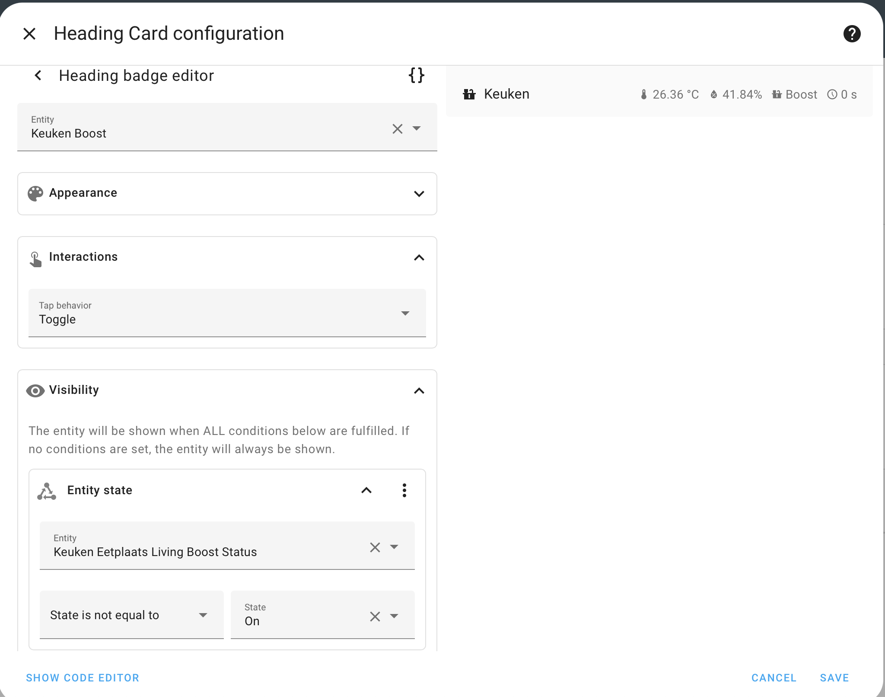

Home Assistant biedt uitgebreide mogelijkheden om je dashboards te personaliseren, met behulp van **views** en **layouts**. In deze blogpost laat ik je zien hoe je een **sectie header** kunt maken met een veranderbare entiteit en hoe je met zichtbaarheid (visibility) extra functionaliteiten kunt toevoegen. 

Het doel is om een sectie header te creëren dat de *locatie*, temperatuur en luchtvochtigheid toont en waarmee je de ventilatie van een ruimte kunt boosten. Als de boost geactiveerd is, willen we de boost-knop verbergen en laten zien hoelang de boost nog actief is.

Het is belangrijk om te weten dat ik in mijn voorbeeld gebruikmaak van de Renson Healthbox 3, dus sommige instellingen gaan voor jullie anders zijn.


## 1. Begin met de Edit-modus

Open je dashboard in Home Assistant en ga naar de **edit-modus** van je view. Beweeg met de muis over de **Heading Card** waar je de header wilt aanpassen, en klik op het **potlood-icoon** dat verschijnt. 


## 2. Voeg een Heading en Entiteiten toe

In het bewerkingsscherm kun je de titel en het icoon voor je sectie instellen. In mijn voorbeeld heb ik de heading **"Keuken"** gekozen met een icoon dat lijkt op een keukenwerkblad.

Daarnaast koppel je entiteiten aan de header. In dit voorbeeld heb ik de volgende entiteiten toegevoegd:
- **Temperatuur** 
- **Luchtvochtigheid**
- **Keuken Boost-script** (om de ventilatie te activeren)
- **Resterende boost-tijd**


---

## 3. Zichtbaarheid instellen voor de Boost-knop

Klik op het potlood-icoon naast de entiteit **Keuken Boost**. Het scherm veranderd naar
waar je de zichtbaarheid van deze entiteit kunt configureren. Gebruik de volgende logica:
- De Boost-knop is alleen zichtbaar als de status **niet gelijk is aan "Aan"**. Dit is handig als je meerdere statussen hebt, want deze logica zorgt ervoor dat het altijd correct werkt.



> **Tip**: Vergeet niet om de interactie-instellingen aan te passen. Omdat het een script betreft, kun je dit eenvoudig instellen als een **Toggle**.

---

## 4. Zichtbaarheid instellen voor de Resterende Boost-tijd

Voor de entiteit die de resterende boost-tijd toont, pas je dezelfde logica toe, maar stel je in dat deze alleen zichtbaar is als de status **gelijk is aan "Aan"**. Hierdoor verschijnt de resterende tijd alleen wanneer de boost actief is.


## 5. De configuratie in code

```yaml
type: heading
heading: Keuken
heading_style: title
icon: mdi:countertop
badges:
  - type: entity
    entity: sensor.keuken_eetplaats_living_temperature
  - type: entity
    entity: sensor.keuken_eetplaats_living_humidity
  - type: entity
    show_state: true
    show_icon: true
    entity: script.keuken_boost
    name: Boost
    state_content: name
    tap_action:
      action: toggle
    visibility:
      - condition: state
        entity: binary_sensor.keuken_eetplaats_living_boost_status
        state_not: "on"
  - type: entity
    show_state: true
    show_icon: true
    entity: sensor.keuken_eetplaats_living_boost_remaining
    visibility:
      - condition: state
        entity: binary_sensor.keuken_eetplaats_living_boost_status
        state: "on"
```

Met deze stappen kun je een functionele en visueel aantrekkelijke sectie header maken die slim inspeelt op de status van je entiteiten. Dit biedt niet alleen meer gebruiksgemak, maar zorgt er ook voor dat je dashboard overzichtelijk blijft.

Veel succes met je project in Home Assistant!
